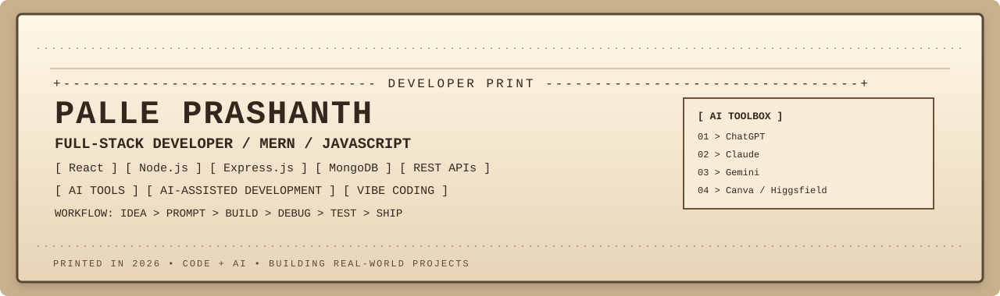

 

### ✦ 𝓑𝓾𝓲𝓵𝓭𝓲𝓷𝓰 𝓓𝓲𝓰𝓲𝓽𝓪𝓵 𝓟𝓻𝓸𝓭𝓾𝓬𝓽𝓼 𝔀𝓲𝓽𝓱 𝓒𝓸𝓭𝓮 + 𝓐𝓘 ✦

 

---

# 🌐 𝓐𝓫𝓸𝓾𝓽 𝓜𝓮

<i>I am Palle Prashanth, a B.Tech student in Artificial Intelligence & Data Science and a Full-Stack Developer in progress.</i>

<i>I build modern web applications across the frontend and backend, use AI tools as a development partner, and follow vibe-coding workflows to prototype, debug, iterate and ship faster.</i>

🎓 <i><b>B.Tech — Artificial Intelligence & Data Science</b></i>  
🏫 <i>RSR Engineering College, Kavali</i>  
📅 <i>2025–2029</i>  
📍 <i>India</i>  
💻 <i><b>Focus:</b> Full-Stack Development • MERN • AI-Assisted Development</i>

> <em>✧ “Think in ideas. Build with code. Accelerate with AI. Ship what works.” ✧</em>

---

# ⚡ 𝓜𝔂 𝓣𝓮𝓬𝓱 𝓢𝓽𝓪𝓬𝓴

### ⚛️ <em>Frontend</em>
<i>HTML5 • CSS3 • JavaScript • React.js • TypeScript • Responsive UI/UX • API Integration</i>

### 🟢 <em>Backend</em>
<i>Node.js • Express.js • REST APIs • Routing • Middleware • CRUD • Authentication</i>

### 🍃 <em>Database</em>
<i>MongoDB • MongoDB Atlas • Mongoose • Data Modeling • CRUD Operations</i>

### 🤖 <em>AI + Vibe Coding</em>
<i>AI-assisted coding • Prompt-driven development • Rapid prototyping • Debugging with AI • Idea-to-product workflows</i>

### 🛠️ <em>Tools</em>
<i>Git • GitHub • VS Code • Postman • Vercel • Figma</i>

---

# 🚀 𝓕𝓮𝓪𝓽𝓾𝓻𝓮𝓭 𝓟𝓻𝓸𝓳𝓮𝓬𝓽𝓼

## 💍 𝓤𝓼𝓽𝓪𝓿𝓥𝓲𝓫𝓱𝓪𝓿 𝓦𝓮𝓭𝓭𝓲𝓷𝓰 𝓟𝓵𝓪𝓷𝓷𝓮𝓻𝓼
<i>Premium Indian wedding-planning website with traditional visual design, responsive UI, smooth animations, gallery interactions and WhatsApp enquiry flow.</i>

**Tech:** <i>HTML • CSS • JavaScript</i>  
🔗 <a href="https://github.com/palleprashanthp4-dev/ustavvibhav-wedding-planners"><i>Repository</i></a> • 🚀 <a href="https://ustavvibhav-wedding-planners.vercel.app/"><i>Live Demo</i></a>

---

## 🛍️ 𝓕𝓵𝓲𝓹𝓴𝓪𝓻𝓽 𝓒𝓵𝓸𝓷𝓮 — 𝓕𝓻𝓸𝓷𝓽𝓮𝓷𝓭
<i>Responsive e-commerce frontend with product cards, categories, navigation, promotional sections, hover interactions and JavaScript functionality.</i>

**Tech:** <i>HTML • CSS • JavaScript</i>  
🔗 <a href="https://github.com/palleprashanthp4-dev/flipkart-clone-frontend"><i>Repository</i></a> • 🚀 <a href="https://flipkart-clone-frontend-r878.vercel.app/"><i>Live Demo</i></a>

---

## 💼 𝓓𝓲𝓰𝓲𝓽𝓪𝓵 𝓢𝓸𝓵𝓾𝓽𝓲𝓸𝓷𝓼
<i>Startup-oriented digital services website concept covering web development, app development, UI/UX, digital marketing and business-growth solutions.</i>

**Tech:** <i>Next.js • TypeScript</i>  
🔗 <a href="https://github.com/palleprashanthp4-dev/digital-socket"><i>Repository</i></a>

---

## 🎓 𝓛𝓮𝓪𝓻𝓷𝓸 𝓓𝓲𝓼𝓬𝓸𝓿𝓮𝓻𝔂
<i>Learning and career-discovery platform concept for exploring technology resources and structured learning paths.</i>

**Tech:** <i>HTML • CSS • JavaScript</i>  
🔗 <a href="https://github.com/palleprashanthp4-dev/learno-discovery"><i>Repository</i></a> • 🚀 <a href="https://learno-discovery.vercel.app/"><i>Live Demo</i></a>

---

## 💊 𝓟𝓱𝓪𝓻𝓶𝓪𝓬𝔂 𝓔-𝓒𝓸𝓶𝓶𝓮𝓻𝓬𝓮
<i>E-commerce project focused on product browsing and pharmacy-oriented shopping UI.</i>  
🔗 <a href="https://github.com/palleprashanthp4-dev/pharmacy-ecommerce-web-app"><i>Repository</i></a>

---

## 👕 𝓤𝓻𝓫𝓪𝓷 𝓦𝓮𝓪𝓻 𝓔-𝓒𝓸𝓶𝓶𝓮𝓻𝓬𝓮
<i>E-commerce interface focused on product presentation, shopping UI and responsive web design.</i>  
🔗 <a href="https://github.com/palleprashanthp4-dev/urban-wear-Ecom-project"><i>Repository</i></a>

---

# 📊 𝓓𝓪𝓽𝓪 & 𝓐𝓷𝓪𝓵𝔂𝓽𝓲𝓬𝓼

<i>My Artificial Intelligence & Data Science background also gives me practical experience with dashboards, KPIs and business analysis.</i>

| <em>Project</em> | <em>Technology</em> | <em>Repository</em> |
|---|---|---|
| 📈 <i>HR Analytics Dashboard</i> | <i>Power BI • Excel</i> | <a href="https://github.com/palleprashanthp4-dev/HR-Analytics-Dashboard">View Project</a> |
| 💰 <i>Employee Payroll Management</i> | <i>Excel • Payroll Analysis</i> | <a href="https://github.com/palleprashanthp4-dev/Employee-Payroll-Management">View Project</a> |

---

# 🤖 𝓐𝓘 + 𝓥𝓲𝓫𝓮 𝓒𝓸𝓭𝓲𝓷𝓰

<i>AI is my development partner — helping me move from idea to prototype to product faster.</i>

  

`IDEA` → `PROMPT` → `PROTOTYPE` → `CODE` → `DEBUG` → `TEST` → `SHIP`

  

<em>⚡ Rapid prototyping • 🧠 AI-assisted problem solving • 🎨 UI generation • 🔧 Debugging • 🚀 Product iteration</em>

---

# 🔐 𝓕𝓾𝓵𝓵-𝓢𝓽𝓪𝓬𝓴 𝓢𝓴𝓲𝓵𝓵𝓼

- ⚛️ <i>React component development</i>
- 🧩 <i>Reusable UI, state and props</i>
- 🔄 <i>REST API integration</i>
- 🟢 <i>Node.js backend development</i>
- 🚀 <i>Express.js API development</i>
- 🍃 <i>MongoDB database integration</i>
- 🧱 <i>Mongoose schemas and models</i>
- 🔐 <i>Authentication and authorization</i>
- 📝 <i>CRUD applications</i>
- 📡 <i>API testing with Postman</i>
- ☁️ <i>Deployment and Git workflows</i>
- 🤖 <i>AI-assisted development</i>
- ⚡ <i>Vibe coding and rapid prototyping</i>

---

# 🗺️ 𝓕𝓾𝓵𝓵-𝓢𝓽𝓪𝓬𝓴 𝓡𝓸𝓪𝓭𝓶𝓪𝓹

### <i>HTML + CSS → JavaScript → React → Node.js → Express.js → MongoDB → REST APIs → Authentication → AI-Assisted Development → Full-Stack Projects → Deployment</i>

 

---

# 📈 𝓖𝓲𝓽𝓗𝓾𝓫 𝓢𝓽𝓪𝓽𝓼

  

---

# 🎯 𝓒𝓪𝓻𝓮𝓮𝓻 𝓕𝓸𝓬𝓾𝓼

## <em>𝓕𝓾𝓵𝓵-𝓢𝓽𝓪𝓬𝓴 𝓓𝓮𝓿𝓮𝓵𝓸𝓹𝓮𝓻</em>

<i>Full-Stack Developer • MERN Developer • JavaScript Developer • AI-Assisted Developer • Vibe Coder</i>

  

<i>Building responsive, scalable and real-world web applications while using modern AI tools to prototype, solve problems and iterate faster.</i>

---

# 📫 𝓛𝓮𝓽'𝓼 𝓒𝓸𝓷𝓷𝓮𝓬𝓽

  

<em>✦ Open to opportunities, collaborations and building meaningful digital products. ✦</em>

